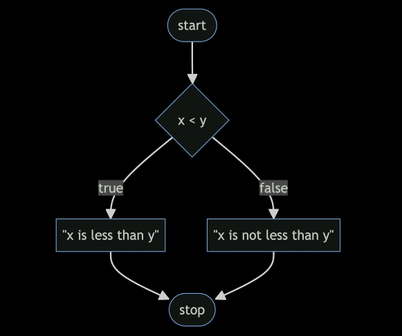

# CS50 WEEK 1: C

## 개념

### compiler

|         인간 언어          | 컴파일러 | 컴퓨터 언어 |
| :------------------------: | :------: | :---------: |
| Java<br>C<br>Python<br>... |    ▶     | 0010101001  |

- 인간이 입력한 언어를 컴퓨터가 이해할 수 있도록 바꿔주는 역할
- 실행하고 나면 같은 이름의 확장자 없는 파일이 생성 됨

### void

- return / input이 없을 때 대신 써줌

### Linux

|       textual interface       | graphical user interface |
| :---------------------------: | :----------------------: |
|     terminal<br>git bash      |       git desktop        |
| send commands to Linux system |                          |

- mv: mv meow.c woof.c: meow.c를 woof.c로 바꿈 (rename)
- cd: change directory
- cp: copy
- ls: 파일 리스트 보여줌
- rm: remove - 파일 지움
- mkdir: make directory
- rmdir

### integer overflow

- 숫자를 너무 크게 저장해서 메모리를 초과하는 것

### truncation

- integer 기반으로 계산을 하기 때문에 decimal point 이후의 값은 버리는 현상

### type casting

- 하나의 타입을 다른 것으로 변형시키는 것

### floating-point imprecision

- 메모리 용량의 제한으로 계산 결과가 부정확해지는 현상

## C

### printf

1. 기본
   - 파일 명: hello.c
     - 확장자 c
   - convention
     - all lower case
     - no spaces
   - argument ▶ function ▶ return value
2. 진행

   - Create a file: Terminal

     ```
     $ code hello.c
     ```

   - Write Code: IDE

     ```C
     #include <cs50.h>
     #include <stdio.h> //1

     int main(void) {
        string answer = get_string("What's your name? "); // 2
        printf("Hello, %s\n", answer); //3
     }
     ```

     - 1: header file, library
       - cs50.h includes the function get_string
       - stdio.h includes the function printf
     - 2: should declare what type the variable is
     - 3
       - f: format
       - %s: string value ▶ print _answer_
       - \n: change a line

   - Compile & Run: Terminal
     ```
     make hello //1
     ./hello
     ```
   - 1: compile the file - should be commanded whenever the file is fixed

### Number

| 유형        | 형식 | 참고                                     |
| :---------- | :--- | :--------------------------------------- |
| long double | %L   | 8 바이트 이상                            |
| double      | %d   | 8 바이트                                 |
| float       | %f   | 4 바이트<br>%.6f: 소수점 아래 6자리 출력 |
| int         | %i   | 4 바이트                                 |

1. compare

   ```c
   #include <cs50.h>
   #include <stdio.h>
   int main (void)
   {
       int x = get_int("What's x? ");
       int y = get_int("What's y? ");

       if (x < y) //1
       {
           printf("x is less than y\n");
       }
       else if (x > y)
       {
           printf("x is not less than y\n");
       }
       else
       {
           printf("x is equal to y\n");
       }
   }

   ```

   - 1: Boolean
   - ==: equals (= is used for assignment)
     
   - why do we use else if?
     - for shotter comparison

2. Integer

   ```c
   int counter = 0; //1

   // how to add 1
   counter = counter + 1; //2
   counter += 1;
   counter++;

   // minus 1
   counter--;

   ```

   - 1: variable type name = integer
   - 2: assignment

### char

1. char

   ```c
   #include <cs50.h>
   #include <stdio.h>

   int void(main)
   {
       char c = get_char("Do you agree? ");

       if (c == 'y' || c == 'Y')
       {
           printf("Agreed.\n");
       }
       else if (c == 'n' || c == 'N')
       {
           printf("Not agreed.\n");
       }
   }
   ```

   - comparison

   |  char  |  string  |
   | :----: | :------: | ---- |
   | single | multiple |
   |   -    |          | : or |

   - && : and

### loop

1. while

   ```c
   int counter = 3;
   while(counter > 0)
   {
       printf("meow\n");
       counter--;
   }

   int counter = 0;
   while(counter < 3)
   {
       printf("meow\n");
       counter++;
   }
   ```

   - <= : do not set condition that goes through the number (convention)
   - true: keep loop ongoing forever

2. for

   ```c
   for (int i = 0; i < 3; i++)
   {
       printf("meow\n");
   }
   ```

   - process
     - i = 0
       - i is less than 3
       - print meow
     - i++
       - i is less than 3
       - print meow
     - i++
       - i is less than 3
       - print meow
     - i++
       - i is equal to 3
       - break

3. do while

   ```c
   // Prompt user for positive integer
   int n // 2

   do
   {
       n = get_int("Size: "); // 1
   }
   while (n < 1);

   for (int i = 0; i < n; i++)
   {
       for (int j = 0; j < n; j++)
       {
           printf('#');
       }
       print("\n");
   }
   ```

   - 1: if you declare the variable n here, you can't use it outside so 2 is required

### Function

1. Declare a function

   ```c
   #include <stdio.h>

   void meow(void); //1

   int main(void)
   {
      for (int i = 0; i < 3; i++)
       {
           meow();
       }
   }

   void meow(void)
   {
       printf("meow\n");
   }
   ```

   - 1: Prototype, You can create your function above the function main but it is better to just declare the prototype before the main

2. Update the code

   ```c
   #include <stdio.h>

   void meow(void);

   int main(void)
   {
      meow(3000);
   }

   void meow(int n)
   {
       for (int i = 0; i < n; i++)
       {
           printf("meow\n");

       }
   }
   ```

### calculator.c

```c
#include <cs50.h>
#include <stdio.h>

int add(void);

int main(void)
{
    int x = get_int("x: ");
    int y = get_int("y: ");

    int z = add2(x, y);
    printf("%i\n", z);
}

int add(void)
{
    return x + y; // 1
}

int add2(int a, int b)
{
    return a + b;
}
```

- 1: error (x is declared in the function main not add)

### mario.c

```c
#include <cs50.h>
#include <stdio.h>

int main(void) // 2
{
    // print 4 ? boxes
    for (int i = 0; i < 4; i++)
    {
        printf("?");
    }
    printf("\n");

    // print blocks
    int n = get_int("Size: "); //1

    while (n < 1)
    {
        n = get_int("Size: ");
    }

    for (int i = 0; i < n; i++)
    {
        for (int j = 0; j < n; j++)
        {
            printf('#');
        }
        print("\n");
    }

}
```

- const(1): not to change the variable easily, not use the variable again
- 2: a better loop is do - while
